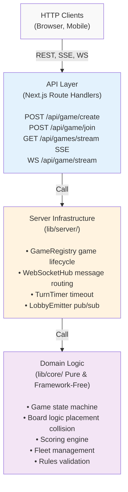
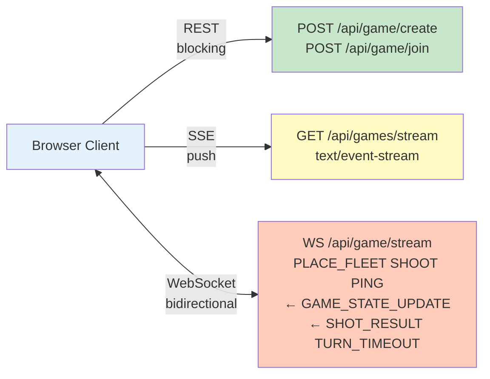

# Exercise 1: Game Core Logic and Data Structures

This document records the design rationale behind the Battleship implementation in this repository: data structures, FE/BE split, communication protocol, and a few non-obvious decisions worth highlighting to the reviewers.

---

## Table of Contents

- [System Architecture](#system-architecture)
- [Data Structures and Extensibility](#data-structures-and-extensibility)
- [Separation of Concerns (FE vs BE)](#separation-of-concerns-fe-vs-be)
- [API Specification](#api-specification)
- [Communication Protocol Justification](#communication-protocol-justification)
- [Server Authority & State Sanitisation](#server-authority-state-sanitisation)
- [Turn Semantics](#turn-semantics)
- [Clock & RNG Injection](#clock-rng-injection)
- [Scoring Engine — Parameterised](#scoring-engine--parameterised)
- [Real-time Transport: Custom Node Server](#real-time-transport-custom-node-server)
- [CSS Scoping & Theming](#css-scoping-theming)
- [In-Memory State Seam](#in-memory-state-seam)
- [Simplicity & Readability](#simplicity--readability)
- [UI Type Centralisation](#ui-type-centralisation)
- [Mobile-first UX](#mobile-first-ux)
- [Test Strategy](#test-strategy)
- [Error Boundaries](#error-boundaries)
- [Health & Readiness Probes](#health--readiness-probes-p0)
- [Verification](#verification)

---

## System Architecture

The backend follows a **Layered + Event-Driven** pattern:

### Layer Diagram



### Module Responsibilities

| Module                        | Responsibility                                                                     | Pattern                               |
| ----------------------------- | ---------------------------------------------------------------------------------- | ------------------------------------- |
| `lib/core/game.ts`            | State transitions (`lobby` → `placement` → `playing` → `finished`), enforces rules | Pure functions, no mutations          |
| `lib/core/board.ts`           | Spatial queries (placement bounds, collision detection, hit resolution)            | Pure, O(1) access via 2D array        |
| `lib/core/scoring.ts`         | Score calculation (base, accuracy bonus, streak, reflex, penalties)                | Parameterised by `EliteConfig`        |
| `lib/core/fleet.ts`           | Ship placement, extensible to non-linear shapes                                    | Lazy evaluation via `expandShipCells` |
| `lib/core/rules.ts`           | Turn mechanics, validation guards                                                  | Single-responsibility helpers         |
| `lib/server/registry.ts`      | Game lifecycle (create, get, update, list, delete)                                 | Interface seam for Redis migration    |
| `lib/server/ws/hub.ts`        | WebSocket message routing and broadcast                                            | Pub/sub per game, O(n) fan-out        |
| `lib/server/turn-timer.ts`    | Timeout enforcement with injection                                                 | Clearable via `AbortController`       |
| `lib/server/lobby-emitter.ts` | Joinable games list push notifications                                             | Singleton observable                  |

### Communication Paths

Three transports, each optimized for its use case:



**Design rationale:**

- **REST** for idempotent setup (create game, join game) — transactional semantics, built-in retry logic
- **SSE** for lobby — unidirectional push, auto-reconnect, multiplexed on HTTP/2
- **WebSocket** for in-game — bidirectional persistent TCP, minimal latency (required for 3s reflex bonus)

### Data Flow: Example (Player Shoots)

```
1. Client clicks enemy board cell (r=2, c=4)
2. GameProvider sends { type: 'SHOOT', payload: { r: 2, c: 4 } } over WS
3. Hub receives message, looks up game from gameId
4. validateShot(game, shooterId, r, c) checks board bounds, cell not already targeted
5. applyShot(game, r, c) → applyHitToShips(game, r, c) → modifies game.players[shooterId].board
6. awardScore(game, shooterId, hit, config) computes points with bonuses/penalties
7. applyShotResult(...) updates activePlayerId, checks for win condition
8. sanitizeGameStateFor(state, playerId) redacts opponent ships, returns two variants
9. Hub broadcasts: SHOT_RESULT (both), GAME_STATE_UPDATE (each player gets sanitised view)
10. Both clients receive updates, UI re-renders score, turn, board state
```

### Extensibility Seams

The architecture is designed for Exercise 3 (concurrency) and Exercise 4 (spectator mode):

- **`GameRegistry` interface** — swappable in-memory → Redis without touching handlers or core
- **`EliteConfig` object** — scoring curve parameterised for custom game modes, time-limited events
- **`Clock` and `Rng` interfaces** — injectable time and randomness for testability and future deterministic replay
- **`WebSocketHub` interface** — prep for sidecar pub/sub or managed service (e.g., Redis Streams)

### Further Extensibility Seams

Three additional gaps were identified and refactored using the same Strategy-pattern philosophy as the scoring engine.

**Board size** (`GameConfig.boardSize`, default 8) — `createEmptyGrid(size)` and `isInBounds(r, c, size)` now accept an optional `size` parameter; `canPlace` and `applyShot` derive the size from `grid.length`. A "Blitz" mode on a 6×6 board requires only a different `GameConfig.boardSize` value — no source edits.

**Win condition** (`WinConditionStrategy` in `rules.ts`) — the interface exposes `isGameOver(opponentShips, state)` and is the extension point for custom end conditions (points race, time limit, etc.). `resolveWinCondition(mode)` is an exhaustive-switch factory that returns `allShipsSunkCondition` for all current modes; adding a new `GameMode` without a factory case is a TypeScript compile error. `processShot` in `game.ts` delegates to the resolved strategy.

**Turn progression** (`TurnStrategy` in `rules.ts`) — the interface exposes `nextPlayer(game, shooterId, hit)`. Two concrete implementations ship: `alternatingTurnStrategy` (current default — turns always alternate) and `hitKeepsTurnStrategy` (shooter keeps the turn on a hit, a common Battleship variant). `resolveTurnStrategy(mode)` uses the same exhaustive-switch pattern; `applyShotResult` in `game.ts` consults it.

Two further gaps were identified but left as design seams rather than implementations:

**Composable placement rules** — `canPlace()` currently enforces bounds + no-collision inline. A `PlacementRule[]` composition pattern (`boundsRule`, `collisionRule`, `adjacencyRule`) would make new constraints addable without editing the function. Implementing it now would require updating the `canPlace` call signature used in tests even to preserve identical behaviour — the trade-off is not justified at this scale. The `cells?: Coordinate[]` field in `ShipDefinition` is the analogous seam for non-linear ship shapes.

**Open ship type registry** — `ShipType` is a closed union, but `buildFleet(config, idFactory, definitions?)` already accepts injectable `definitions`, making the composition mechanism available. Widening `ShipType` to `string` would break `FleetConfig = Partial<Record<ShipType, number>>` and the DTO allowlist in `dto.ts`. The right long-term design is a `ShipTypeRegistry` service with an `isKnownType` guard; the trade-off (compile-time safety vs runtime extensibility) favours the current closed union at this project scale.

---

## Data Structures and Extensibility

### Board

The game board is an **8×8 2-D array** of `BoardCellStatus = 'empty' | 'ship' | 'hit' | 'miss'`. Direct indexing gives `O(1)` access for both placement checks and shot resolution, which dominates the per-action cost.

```
grid[r][c]  // r,c ∈ [0,8); r maps to row A-H, c maps to column 1-8
```

Memory: 64 small string slots per player ≈ negligible. Alternative representations (`Map<string, status>` or bit-packed `BigInt`) trade CPU clarity for marginal memory wins; the cost of an 8×8 array is small enough that simplicity wins.

### Ships

Ships are plain objects:

```ts
interface Ship {
  id: string;
  type: ShipType; // closed union: 'Cruiser' | 'Destroyer' | 'Submarine'
  length: number;
  hits: number;
  positions: Coordinate[]; // resolved cells after placement
  placed: boolean;
  orientation?: ShipOrientation;
}
```

A `ShipDefinition` is the catalog entry:

```ts
interface ShipDefinition {
  length: number;
  cells?: readonly Coordinate[]; // reserved for non-linear shapes
}
```

**Extensibility seam — `buildFleet(config, idFactory, definitions?)`** in `lib/core/fleet.ts` accepts an injectable `definitions` map. Adding a new linear ship type (`Carrier`, length 5) is **one literal-union extension + one record entry**:

```ts
// types.ts
type ShipType = 'Cruiser' | 'Destroyer' | 'Submarine' | 'Carrier';

// fleet.ts
DEFAULT_SHIP_DEFINITIONS = { ..., Carrier: { length: 5 } };
```

A non-linear ship (T-shape, L-shape) is supported by populating `cells: Coordinate[]` on the definition — the placement code already iterates over per-cell coordinates returned by `expandShipCells`, so the only change is to make that helper consult `cells` when present. No board, scoring, or rules code changes.

### Game state

```ts
interface GameState {
  id: string;
  status: "lobby" | "placement" | "playing" | "finished";
  config: GameConfig; // mode, fleet, turnTimerMs, optional EliteConfig overrides
  players: Record<string, PlayerState>;
  activePlayerId: string | null;
  lastActionTime: number; // timestamp from injected Clock
  createdAt: number;
  turnDeadlineAt: number | null;
  winnerId: string | null;
}
```

The state machine is enforced through pure transitions in `lib/core/game.ts` (`createGame`, `addSecondPlayer`, `placeFleet`, `processShot`, `handleTurnTimeout`). Each transition takes the current state and a deps bag (`{ clock, rng, idFactory }`) and returns the next state plus, where relevant, a `ShotResult`. **No transition mutates its arguments** — Command Query Separation is honored throughout.

---

## Separation of Concerns (FE vs BE)

- **Backend** — single source of truth. The `lib/core/` modules contain all game rules; `lib/server/` wraps them with an in-memory registry, a per-game turn-timer manager, and a WebSocket hub. The server validates every action (`validateShot`, fleet placement integrity), advances the state machine, applies the scoring engine, and broadcasts sanitised updates. Clients never compute authoritative state.
- **Frontend** — strictly presentational. `lib/ui/GameProvider.tsx` opens one WebSocket per game, dispatches messages, and exposes `state`, `lastShot`, `placeFleet`, `shoot`. UI components (`Board`, `ShipPalette`, `Hud/*`, `Effects/*`) read from context, render, and dispatch user intents back through the provider.
- **Pure UI state** (e.g. drag-and-drop placement) lives in `lib/ui/placementReducer.ts`, a framework-agnostic reducer that is unit-tested without React (`lib/ui/__tests__/placementReducer.test.ts`, 17 tests).

---

## API Specification

### REST

| Method | Path               | Body                                         | Response               |
| ------ | ------------------ | -------------------------------------------- | ---------------------- |
| POST   | `/api/game/create` | `{ mode, playerName, fleet?, turnTimerMs? }` | `{ gameId, playerId }` |
| POST   | `/api/game/join`   | `{ gameId, playerName }`                     | `{ gameId, playerId }` |

Validation is centralised in `packages/core/src/api/dto.ts` (no external schema library — handwritten guards, 16 tests). Validation errors return `{ error: { code, message } }` with `400 BAD_REQUEST`; missing/locked games return `404 GAME_NOT_FOUND` / `409 GAME_NOT_JOINABLE`.

### Server-Sent Events (SSE)

`GET /api/games/stream` — `text/event-stream`

**Server → Client** (each event is a JSON object)

```ts
// event: message (default)
data: { games: LobbyGameDto[] }
```

The stream delivers an initial snapshot immediately on connect, then pushes a fresh snapshot each time the joinable-game list changes (a game is created or a player joins). The client never sends data on this connection — it is strictly unidirectional. Browser `EventSource` handles automatic reconnection; no custom backoff logic is required on the client.

**Trigger points** on the server:

- `POST /api/game/create` calls `getLobbyEmitter().notify()` after `registry.create(game)`.
- `POST /api/game/join` calls `getLobbyEmitter().notify()` after `registry.update(...)`.

`LobbyEmitter` (`packages/core/src/server/lobby-emitter.ts`) is a lightweight observable pinned to `globalThis` (same pattern as `GameRegistry` and `WebSocketHub`), so it is shared across Next.js module reloads in dev without creating duplicate instances.

**Why SSE for the lobby and not for in-game flows** — see [Communication Protocol Justification](#communication-protocol-justification).

### WebSocket

`ws://<host>/api/game/stream?gameId={id}&playerId={id}`

**Client → Server**

```ts
{ type: 'PLACE_FLEET'; payload: { placements: { shipId, r, c, orientation }[] } }
{ type: 'SHOOT';       payload: { r: number, c: number } }
{ type: 'PING' }
```

**Server → Client**

```ts
{ type: 'GAME_STATE_UPDATE'; payload: { state: GameState /* sanitised per recipient */ } }
{ type: 'SHOT_RESULT';       payload: { shooterId, r, c, hit, sunkShipType?, scoreAwarded, cellStatus } }
{ type: 'TURN_TIMEOUT';      payload: { playerId } }
{ type: 'ERROR';             payload: { code, message } }
{ type: 'PONG' }
```

All messages are JSON-parsed and validated via type guards in `packages/core/src/server/ws/protocol.ts` (17 tests).

---

## Communication Protocol Justification

The system uses **three transports**, each chosen for its fit with the data-flow:

| Transport | Endpoint                         | Direction     | Used for                  |
| --------- | -------------------------------- | ------------- | ------------------------- |
| REST      | `POST /api/game/create`, `/join` | C→S           | State-changing commands   |
| **SSE**   | `GET /api/games/stream`          | **S→C only**  | Lobby push                |
| WebSocket | `/api/game/stream`               | Bidirectional | All in-game communication |

### Why WebSocket for in-game

Battleship Elite mode awards a **reflex bonus** for shots taken within 3 seconds of the turn starting. The reflex window is short enough that HTTP overhead (~50–200 ms per round-trip including TCP/TLS reuse) is no longer negligible. WebSockets give us a persistent, bidirectional TCP connection with no per-message header overhead and no separate request-establishment latency.

Trade-offs:

- WS doesn't auto-reconnect at the protocol layer; `apps/web/lib/ui/useWebSocket.ts` implements exponential backoff (up to 5 attempts).
- WS makes horizontal scaling slightly harder than stateless REST (sticky sessions are required). For Exercise 1 the in-memory `GameRegistry` is single-instance; Exercise 3 swaps in Redis behind the same interface.

### Why SSE for the lobby

The lobby game list was previously polled every 4 s (`LobbyTable.tsx`). A 4 s lag is visible when a newly created game doesn't appear until the next tick. SSE replaces this with instant push at no extra latency cost.

SSE is the right tool here because:

- The lobby is **strictly unidirectional** (server pushes, client never sends on this connection).
- No WS is open yet — the user is on the home screen before any game context exists.
- `EventSource` reconnects automatically without application code.
- SSE is HTTP-native: works through any HTTP/2 proxy, multiplexed on a single connection, and does not require the Node upgrade path that WebSocket needs.

### Why SSE was NOT extended to other waiting flows

Two other flows superficially look like SSE candidates but were deliberately left on WebSocket:

**Pre-game waiting room** (player 1 waits for player 2 to join) — the WS is already open the moment the player enters `/game/[id]`, because `GameProvider` opens it unconditionally on mount. Replacing this single "opponent joined" event with SSE would require a two-phase connection lifecycle:

```
Home (SSE: lobby stream) → Create → Waiting room (SSE: game join stream) → Both joined → close SSE, open WS
```

This introduces a non-trivial coordination boundary: the client must detect the transition event, close the SSE, negotiate the WS handshake, and receive the initial game state — all before any UI can advance. The margin for a race condition (SSE delivers "both joined", client closes SSE, WS not yet open, server advances state) is real. Since the WS is already open and carries the `GAME_STATE_UPDATE { players: { … } }` payload at negligible cost, the complexity of the two-phase pattern is not justified.

**Placement phase waiting** (one player placed, waiting for the other) — the WS is open and bidirectional: the waiting player might still need to send `PLACE_FLEET` if they haven't, and the server pushes `GAME_STATE_UPDATE` to both sides. There is no moment where the connection is purely unidirectional, so splitting into SSE (push) + REST (send) would create two live connections handling the same game session — added complexity with no benefit.

---

## Server Authority & State Sanitisation

The server is the **only** source of truth. To prevent a client from inspecting opponent ship positions in DevTools (the same payload would otherwise reach the browser), `lib/server/ws/protocol.ts#sanitizeGameStateFor(state, viewerId)` redacts every opponent cell from `'ship'` to `'empty'` before each `GAME_STATE_UPDATE`, and hides opponent ship `positions` until the ship is fully sunk (so the victory screen reveal still works). Hit/miss cells remain public — both players need them for tracking. The sanitisation cost is O(64) per send — negligible.

Security follow-on: this same boundary lets us add per-game rate limits and stricter origin checks later without touching the core.

---

## Turn Semantics

The turn **alternates after every shot, regardless of hit or miss**. This is the most common online Battleship variant and keeps streak bonuses tied purely to the shooter's accuracy (rather than "free extra shots" on hits, which compounds the dynamic accuracy bonus in unintuitive ways). This is enforced in `lib/core/rules.ts#nextActivePlayer`, which is an alias for `getOpponentId` — the design choice is encoded as documentation, not branching logic.

---

## Clock & RNG Injection

All time and randomness flow through interfaces:

```ts
interface Clock {
  now(): number;
}
interface Rng {
  next(): number;
}
```

`makeSystemClock()` / `makeSystemRng()` are used in production (`server.ts`); tests inject `makeFakeClock()` and `makeSeededRng(seed)` (mulberry32). This is **why the reflex-bonus boundary at exactly 3000 ms is unit-testable** (`lib/core/__tests__/scoring.test.ts`) and **why the dice roll is deterministic in tests** (`lib/core/__tests__/rules.test.ts`).

No `Date.now()` or `Math.random()` call appears inside `lib/core/**`. The CLAUDE.md hard requirement on injected time is honoured.

---

## Scoring Engine — Parameterised

`lib/core/scoring.ts` exposes `awardScore(input)` as the orchestrator entry point. The Elite scoring curve is parameterised by an `EliteConfig`:

```ts
interface EliteConfig {
  basePoints: number; // 10
  accuracyBonusMax: number; // 40 — added at p=0, scales linearly with (1-p)
  multipliers: number[]; // [1, 1, 1.5, 2, 3] indexed by consecutiveHits, clamped
  reflexWindowMs: number; // 3000
  reflexMultiplier: number; // 1.2
  missPenalty: number; // -2
}
```

The same module exposes `DEFAULT_ELITE_CONFIG`. Game configs can pass `Partial<EliteConfig>` to override individual fields (e.g. a Christmas event with `reflexMultiplier: 2`) without touching the algorithm. The miss-penalty floor at zero is **applied by the game layer** (`processShot` in `lib/core/game.ts`), keeping `awardScore` a pure delta calculator — single source of truth for the floor rule.

Modes:

- **Classic**: 1 pt/hit, no bonuses, no penalties.
- **Risk**: 10 pts/hit, −1 pt/miss, floor at 0.
- **Elite**: full scoring (accuracy + streak multiplier + reflex + miss penalty), floor at 0.

### Scoring Strategy Pattern

Each game mode is encapsulated by a concrete `ScoringStrategy` implementation (`classicStrategy`, `riskStrategy`, `EliteStrategy`). The interface exposes two methods — `calculateHitScore` and `calculateMissPenalty` — and is the sole extension point for new modes. A `resolveScoringStrategy(mode, eliteConfig?)` factory resolves the right strategy from a `switch` statement; TypeScript's exhaustiveness checking ensures a build-time error if a new `GameMode` union member is added without a corresponding case. `EliteStrategy` is a class because it carries a resolved `EliteConfig` instance; `classicStrategy` and `riskStrategy` are plain objects because they are stateless. Adding a new game mode requires three steps: extend the `GameMode` union, implement `ScoringStrategy`, and add one `case` to the factory — `awardScore` and all callers remain untouched. The `ScoringStrategy` interface is exported so future packages (e.g. a plugin system or an A/B test scaffold) can inject custom strategies without forking the core.

---

## Real-time Transport: Custom Node Server

Next.js Route Handlers cannot portably upgrade a WebSocket — App Router is request/response oriented. `server.ts` at the repo root wraps Next.js (`next({ dev }).prepare()` then `getRequestHandler()`) and adds a `ws.WebSocketServer({ noServer: true })`. The HTTP server's `upgrade` event handler **only intercepts `/api/game/stream`**, letting Next.js Turbopack HMR keep its own upgrade path untouched.

`pnpm dev` and `pnpm start` both run `tsx server.ts` so TypeScript runs natively without a separate compile step. The in-memory `GameRegistry` and WebSocket `Hub` are pinned to `globalThis` under unique `Symbol.for(...)` keys so that Next.js module reloads in dev don't create duplicate registries (the API routes and the WS server end up sharing the same instances).

Future migration path: when scaling out, the WebSocket fan-out moves to a sidecar (separate Node service or managed pub/sub), and the registry interface is satisfied by a Redis implementation. This is the lead-in for Exercise 3 (concurrency) and Exercise 4 (spectator mode).

**WebSocket origin allowlist:** The `upgrade` handler now validates `req.headers.origin` against a comma-separated `ALLOWED_ORIGINS` env var before delegating to `wss.handleUpgrade`. Unrecognised origins receive `HTTP/1.1 403 Forbidden` and the socket is destroyed — the 403 is written as a raw HTTP response so it appears in browser DevTools rather than an opaque connection refusal. In development (no `ALLOWED_ORIGINS` set), all origins are allowed for DX convenience; the guard activates only in production. The `isOriginAllowed` helper is a pure function, co-located in `server.ts`, making it trivial to replace with a database-backed allowlist if multi-tenant origins are needed later.

---

## CSS Scoping & Theming

Combined approach:

1. **Tailwind v4** — utility classes for layout, spacing, responsive breakpoints (mobile-first). No new global class names are generated.
2. **CSS Modules** — component-level styles with build-time hashed class names (e.g., `Board_cell__3s8d`). Prevents class collisions when multiple teams contribute components. Used by `Board`, `ShipPalette`, `Effects`.
3. **CSS custom properties on `[data-theme="…"]`** — the only mechanism for skinning. `app/globals.css` defines the default token set; `app/_theme/christmas.css` overrides them under `[data-theme="christmas"]`. The marketing team adds a CSS file + flips an attribute on `<html>` and the entire UI re-skins — **no component code changes**.

```css
[data-theme="christmas"] {
  --brand-primary: #c0392b;
  --board-cell-ship: #c0392b;
  /* … */
}
```

This is the explicit "Christmas skin" answer to the spec's CSS-scoping requirement.

---

## In-Memory State Seam

`lib/server/registry.ts` defines a `GameRegistry` interface (`create / get / update / list / listJoinable / delete`) and ships an `InMemoryGameRegistry` implementation pinned to `globalThis`. The interface is the seam for Exercise 3 to swap in a Redis-backed implementation behind the same shape, without changing any handler, route, or core code. The Node.js single-threaded event loop guarantees atomicity for in-memory updates, so no locking is needed at this stage.

---

## Simplicity & Readability

Code organisation follows strict separation:

```
lib/core/      → pure domain (zero framework deps)
lib/server/    → backend infra (registry, turn timer, ws hub + handlers)
lib/api/       → HTTP DTOs and error mapping
lib/ui/        → React-side state (provider, hooks, reducers)
app/           → Next.js App Router pages + components
```

Every function in `lib/core/` is **≤ 50 lines**, every module **≤ 300 lines** (CLAUDE.md hard limits). The previous monolithic `processShot` (~84 lines) is now five composable functions: `validateShot` → `applyShot` + `applyHitToShips` → `awardScore` → `applyShotResult`. Reading each file gives an obvious sense of its single responsibility.

Tests live next to the code they cover (`__tests__/`), one file per module, with no shared mutable state between cases — every `it()` builds its own world. **180 tests** across 12 files, all deterministic.

---

## UI Type Centralisation

Shared UI types (`PlacementState`, `PlacementAction`, `GameContextValue`, `ShotEvent`, `WsConnectionState`) live in a single `lib/ui/types.ts`. Each source file (`GameProvider.tsx`, `placementReducer.ts`, `useWebSocket.ts`) re-exports only what it originally defined; imports now flow from `./types` rather than the implementation file. A barrel `lib/ui/index.ts` aggregates all public UI exports so consumers use one import path.

**Rationale:** colocating shared shapes prevents circular-import drift as the UI grows, and makes it straightforward for multiple teams to add new message types without touching the provider or hook internals. Single-component props remain colocated (not in `types.ts`) to avoid premature generalisation.

---

## Mobile-first UX

Tailwind responsive utilities default to mobile sizing; `min-width: sm` (640 px) breakpoints scale up. Placement uses **Pointer Events on a click-to-place model** rather than HTML5 drag-and-drop — HTML5 DnD is unreliable on iOS Safari, while Pointer Events behave identically across touch, mouse, and pen.

---

## Test Strategy

- Vitest, V8 coverage, `@/*` alias mirrored in `vitest.config.ts`.
- 176 tests across `lib/core` (game + board + scoring + rules + fleet + clock + rng), `lib/server` (registry, turn timer with `vi.useFakeTimers()`, WS protocol + sanitisation), `lib/api` (DTO guards), `lib/ui` (placementReducer).
- Tests are execution-order independent — every `it()` instantiates fresh state.
- **No mocks of `Date.now()` or `Math.random()`** — both flow through injected interfaces; fake implementations are constructed explicitly. The reflex bonus is verified at the exact 3000 ms boundary.

---

## Error Boundaries

React render errors are catastrophic in production — a single unhandled exception unmounts the entire app mid-match. Three Next.js `error.tsx` boundaries have been added to provide graceful fallbacks:

**`apps/web/app/error.tsx`** — Root-level error boundary catching errors in all routes (home, lobby, etc.). Displays "Something went wrong" + "Try Again" (reset) and "Return to Lobby" (navigate home) buttons.

**`apps/web/app/game/error.tsx`** — Game-level boundary protecting PlacementView, PlayView, and related components. Shows "Game Error" + same recovery buttons.

**`apps/web/app/not-found.tsx`** — Custom 404 page for invalid routes (e.g., `/game/invalid-id`), preventing the default Next.js chrome.

All three boundaries use the existing design tokens (`--brand-danger`, `--brand-primary`, `--surface-*`) for consistency with the game UI. Errors are logged to the console; Sentry integration (pipeline errors to external service) is a follow-up. The boundaries handle **render-time errors only**; WebSocket / connection errors remain in GameShell state (not caught by React boundaries).

---

## Health & Readiness Probes

Kubernetes/Fly.io deployment platforms require liveness and readiness probes to manage rolling deploys and traffic gating. Two health check endpoints have been added:

**`GET /api/health`** — Liveness probe that always returns `{ status: 'alive' }` with 200 OK. Fast and stateless (no dependencies checked); signals to the orchestrator that the process is alive. If this endpoint is slow, the platform assumes the process is hung and may restart it.

**`GET /api/ready`** — Readiness probe that checks if `GameRegistry` and `WebSocketHub` singletons are initialized. Returns `{ status: 'ready' }` with 200 OK if ready, or `{ status: 'not_ready' }` with 503 Service Unavailable if booting/shutting down. Used by the orchestrator to gate traffic — new instances are removed from load balancer until they signal readiness.

**Rationale:** Separating liveness (process alive?) from readiness (can accept traffic?) follows Kubernetes best practices. Liveness failures trigger restarts; readiness failures only remove from load balancer. Both are required for graceful rolling deploys and zero-downtime drains. The `/ready` endpoint checks only in-memory singletons; future database/Redis connectivity checks can be added when persistence is implemented.

---

## Verification

```bash
pnpm test            # all 176 tests
pnpm test:coverage   # V8 coverage report on lib/**
pnpm lint            # eslint flat config, clean
pnpm dev             # tsx server.ts — http://localhost:3000
pnpm build           # next build
```

Manual golden path (two browser tabs):

1. Tab A → home → **Create new game** (Elite, default fleet, 60s) → lands on waiting view with shareable Game ID.
2. Tab B → home → lobby list shows the new game → **Join**.
3. Both tabs transition to placement → tap ship in palette → tap cells to place → **Let's play**.
4. Server dice-rolls the first player; turn timer counts down only on the active side.
5. Click cells on the enemy board to shoot → both tabs see hit / miss / sunk toasts, score updates immediately, streak/reflex multipliers visible.
6. Set `<html data-theme="christmas">` in DevTools → UI re-skins instantly with zero component code touched.
