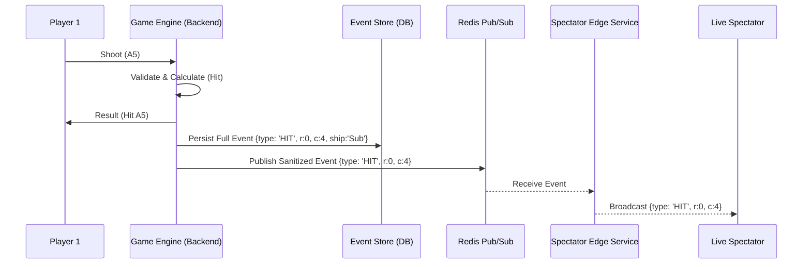
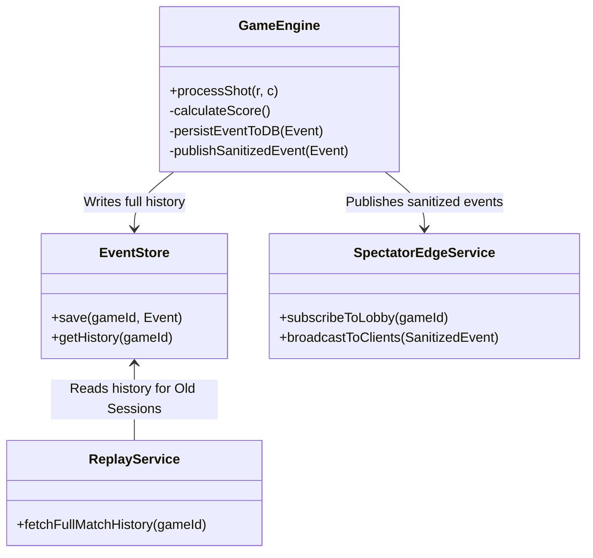

# Exercise 4: Spectator Mode

## Table of Contents
- [Architecture Design](#architecture-design)
- [Communication Pattern Justification](#communication-pattern-justification)
- [Monitoring Strategy](#monitoring-strategy)

## Architecture Design

### Class & Sequence Diagrams
To decouple the core game loop from spectator demands, we implement an **Event-Driven Architecture** using a Pub/Sub message broker (like Redis or Kafka) and the **Event Sourcing** pattern for storing history.

## Communication Pattern Justification

**Chosen Pattern:** Pub/Sub via Message Broker (Redis) + Dedicated Spectator Edge Services.
**Alternative Considered:** Direct WebSocket Broadcasting (Game Engine directly sending messages to all connected spectators).

**Justification:**
The primary risk of Spectator Mode is the "Thundering Herd" problem. If a match becomes popular and 10,000 spectators join, Direct Broadcasting would force the Game Engine to handle 10,000 concurrent WebSocket connections and perform massive memory allocations to fan-out the JSON payloads. This would inevitably spike the Node.js event loop lag, directly ruining the low-latency experience required for the actual players.
By using a Pub/Sub broker, the Game Engine only publishes **one** message per event. Dedicated Spectator Edge Services (which can be autoscaled horizontally independently of the Game Engine) handle the heavy lifting of maintaining WebSocket connections and fanning out data. This ensures `O(1)` performance impact on the players, regardless of the number of spectators.

## Monitoring Strategy

### Player Protection KPIs (Ensuring game performance)

To ensure the players are not affected by the spectator load, we must monitor the core game nodes:

1.  **Event Loop Lag (ms):** Measures the delay in the Node.js thread. Must remain consistently under 10ms. A spike indicates the Game Engine is doing too much synchronous work.
2.  **Time-To-Process-Action (ms):** The duration between receiving a `SHOOT` request and emitting the `SHOT_RESULT`. Ensures the player's Reflex Bonus is calculated fairly.
3.  **Broker Publish Latency:** Time taken to write the event to the Pub/Sub broker. If the broker slows down, it could back up the game engine.

### Broadcast Quality KPIs (Spectator experience)

To ensure viewers have a smooth experience:

1.  **Glass-to-Glass Latency (ms):** Time difference between the player's shot being confirmed and the spectator's UI updating. (Target: < 200ms).
2.  **Spectator Drop/Reconnect Rate (%):** A high rate of WebSocket drops on the Spectator Edge Nodes indicates capacity issues or bad load balancing.
3.  **Edge Node CPU/Memory Usage:** Monitoring the resources of the fan-out servers to trigger horizontal auto-scaling before connection limits are reached.
